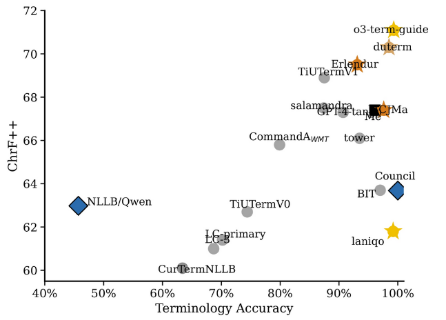

# Terminology-Preserving English → German Translation

A 2-stage MT + LLM post-editor and an LLM council, for keeping mandatory glossary terms in the translation.

This is the codebase from our team project for the University of Tartu course
MTAT.06.055 (*Transformers*), tackling the [WMT25 terminology shared
task](https://github.com/wmt-conference/wmt25-terminology/). It explores two
inference-time strategies for keeping mandatory glossary terms in translation
without retraining any model. The council architecture is inspired by Andrej
Karpathy's [llm-council](https://github.com/karpathy/llm-council).

## Result

| System | chrF++ | Term accuracy |
| --- | ---: | ---: |
| NLLB-MoE-54B alone | 57.9 | 19.1 % |
| NLLB-MoE + Qwen2.5-7B post-editor, no terms | 57.9 | 19.1 % |
| NLLB-MoE + Qwen2.5-7B post-editor, with terms | **63.0** | **45.7 %** |
| LLM Council (3 × 20B members + Mixtral chairman), with terms | **63.7** | **100 %** |

500 sentences from `full_data.ende.jsonl`. Numbers from the team's interim
report; this repo is the reproducible code, not a re-run of the HPC experiments.



## Architecture

Two pipelines, both pure inference-time (no fine-tuning):

**Two-stage post-editor.**
NLLB-MoE-54B produces an initial German translation. A second, instruction-tuned
LLM (Qwen2.5-7B-Instruct) receives the source, the MT output, and a per-sentence
terminology dictionary, and is instructed to make minimal edits: fix
terminology and necessary grammatical agreement only. Without terminology hints
the editor produces stylistic edits that wash out: chrF++ moves by ±0.01. Given
the dictionary, it reliably swaps in the required terms and lifts both metrics.

**LLM Council** (inspired by Karpathy's
[`llm-council`](https://github.com/karpathy/llm-council)).
Three council members translate independently:

- `togethercomputer/GPT-NeoXT-Chat-Base-20B`
- `ai-sage/GigaChat-20B-A3B-instruct`
- `ibm-granite/granite-20b-code-instruct-8k`

Optionally, each member peer-reviews the others' candidates. A chairman
(`mistralai/Mixtral-8x7B-Instruct-v0.1`) receives the source, all candidates,
optional reviews, and the mandatory terminology, and produces the final
translation, selecting and editing as needed.

The report tried five "cases" varying which signals reach the chairman. The
best (case 4) was: chairman may rewrite, no peer review, terms passed to
chairman → 63.7 chrF++, 100 % term accuracy. That is the default in this repo.

## Install

Requires Python ≥ 3.10. The defaults pull large models from Hugging Face
(NLLB-MoE-54B is ~110 GB on disk, Mixtral ~95 GB); meant for HPC use. The
council members and chairman are also large.

```bash
git clone https://github.com/<you>/mt-llm.git
cd mt-llm
python -m venv .venv && source .venv/bin/activate
pip install -e ".[dev]"
```

## Usage

Single sentence, two-stage pipeline:

```bash
python -m mt_llm translate "Open the consumption model and click the Perspectives tab." \
    --terms tests/fixtures/example.json
```

Batch over a JSONL file:

```bash
python -m mt_llm translate --data data/full_data.ende.jsonl --max-items 100 \
    --output preds.jsonl
```

Council mode (defaults to the report's models; only sensible on HPC):

```bash
python -m mt_llm council --data data/full_data.ende.jsonl \
    --terms-to-chairman --output council-preds.jsonl
```

Evaluate predictions:

```bash
python -m mt_llm evaluate --predictions preds.jsonl \
    --references data/full_data.ende.jsonl
```

See `scripts/launch.slurm` for an HPC launch template.

## Data

`data/full_data.ende.jsonl` is the EN-DE file from
[wmt25-terminology](https://github.com/wmt-conference/wmt25-terminology) (500
sentences with per-sentence `proper_terms` glossaries). `ende_dev.jsonl` is the
development variant; `ende.noterm.jsonl` is the same data with terminology
fields stripped, used to isolate the editor's contribution.

## Why terminology constraints matter

We ran the same 500 sentences twice, identical models and seeds, varying only
whether the editor received the terminology dictionary. Without terms, the
editor changed 319/500 outputs but chrF++ moved by –0.01 and term accuracy
stayed at 19.1 %. The edits were noise. With terms, it changed 372/500
outputs, lifted chrF++ by +5.05 and terminology accuracy by +26.6 %. The
editor's value is in being directed; an undirected post-editor mostly trades
one phrasing for another and on aggregate produces no signal.

## Limitations

The current council members are all in the 20 B parameter range, which the
report's analysis shows is too weak to produce granular peer-review feedback;
case 1, 2, and 3 (peer review on, terms off) all sit at ~57 chrF++ and ~37 %
term accuracy. The 26-point jump in term accuracy comes entirely from passing
the terminology dictionary to the chairman. Strengthening the council with
larger, more analytic models is the natural next step.

## Credits

Team project with Bekarys Toleshov and Muhammad Sohaib Anwar. This repo is
my implementation part.
